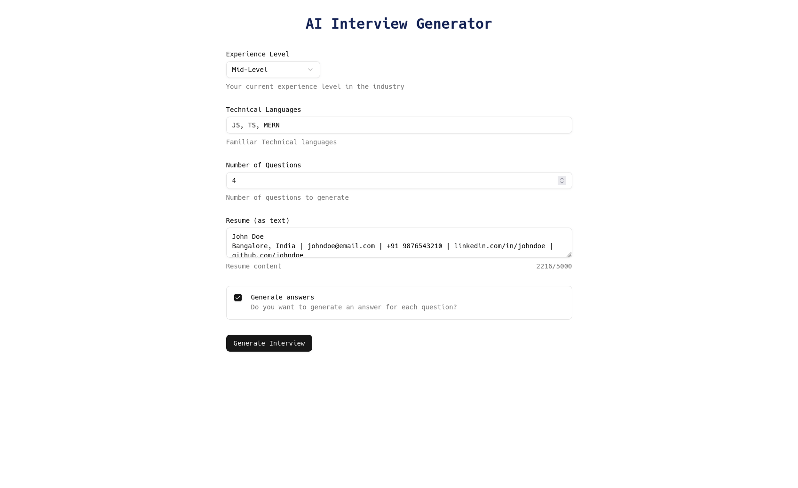
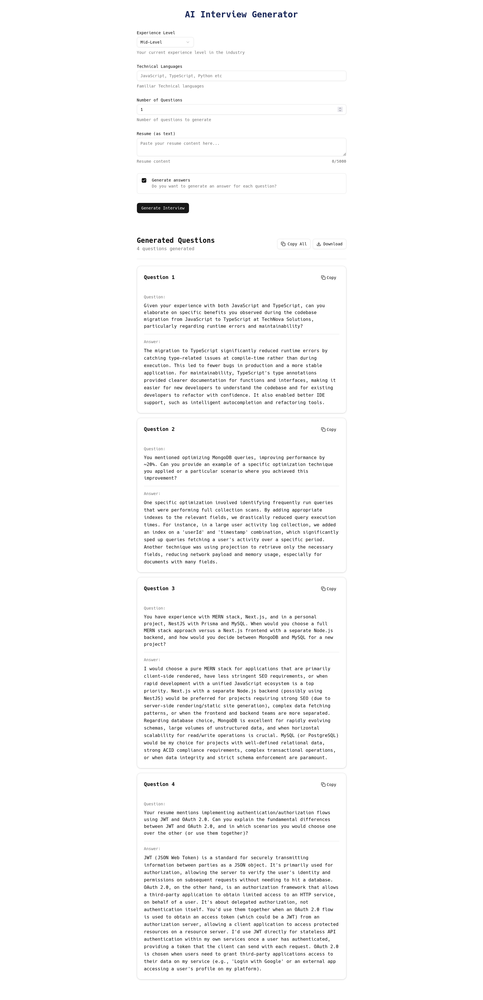

# AI Interview Generator

## Tech Stack
- The frontend (`client/`) is a Vite + React + TypeScript project
- The backend (`server/`) is a Node + Express + TypeScript project

## Development Setup
- For client setup: [client/README.md](./client/README.md)
- For server setup: [server/README.md](./server/README.md)

## ScreenShots

